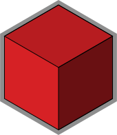

 

#  Testcontainers Infrastructure (TCI) Framework

Modules for XDEV's Testcontainer Infrastructure Framework

## Modules

* [base](./base/)
* [bom](./bom/)
* [db-jdbc-orm](./db-jdbc-orm/)
* [jul-to-slf4j](./jul-to-slf4j/)
* [mockserver](./mockserver/)
* [oidc-server-mock](./oidc-server-mock/)
* [selenium](./selenium/)
* [spring-dao-support](./spring-dao-support/)

## Usage

You may checkout the [advanced demo](./advanced-demo/) - a reference implementation of most features in a realistic project - to get a better feeling how the project can be used.

You can also have a look at the corresponding modules for usage instructions.

> [!TIP]
> More detailed documentation is usually available in the corresponding [JavaDocs](https://javadoc.io/doc/software.xdev.tci/base).

## Installation
[Installation guide for the latest release](https://github.com/xdev-software/tci/releases/latest#Installation)

## Support
If you need support as soon as possible and you can't wait for any pull request, feel free to use [our support](https://xdev.software/en/services/support).

## Contributing
See the [contributing guide](./CONTRIBUTING.md) for detailed instructions on how to get started with our project.

## Dependencies and Licenses
View the [license of the current project](LICENSE) or the [summary including all dependencies](https://xdev-software.github.io/tci)
